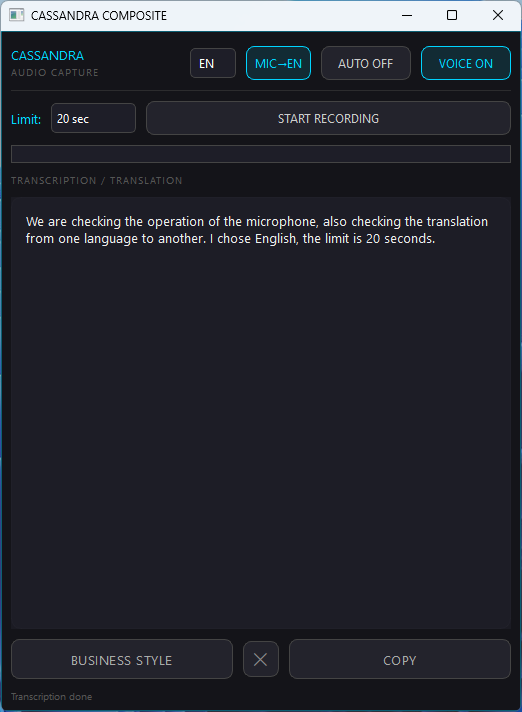

# CASSANDRA COMPOSITE
AI-powered Desktop Assistant for Voice Transcription and Text Translation.

I created this tool for myself to survive in global chats and work with foreign texts without pain. 
It's a simple, fast, and powerful desktop companion that hears your voice and understands any window on your screen

## Key Features
* [cite_start]**Voice Capture**: Record audio (up to 60s) and transcribe it using Gemini 2.0 Flash[cite: 31, 79].
* [cite_start]**Auto-Translation**: Automatically translates selected text or clipboard content into RU, EN, ES, JA, KO, FR, or DE[cite: 3, 38, 48].
* [cite_start]**Voice Engine**: High-quality speech synthesis via Edge TTS[cite: 13, 19].
* [cite_start]**Business Style**: Refines messy transcriptions into professional text using AI[cite: 33, 82].

## Requirements
To run this script, you need Python 3.9+ and the following libraries:
`PySide6`, `google-generativeai`, `edge-tts`, `pygame`, `sounddevice`, `numpy`, `pyperclip`, `uiautomation`, `requests`.

## Setup
1. Get your **Gemini API Key** from Google AI Studio.
2. Run the script: `python translator_recorder.pyw`.
3. [cite_start]Enter your API key when prompted[cite: 12].

### Screenshots

